<div align="center">


<h1>Zero Downtime Deployment Strategies</h1>

<p><strong>The Strategic Foundation for Enterprise Release Engineering, Progressive Rollout Orchestration, and Automated Reliability Governance using Infrastructure as Code</strong></p>

[]()
[]()
[]()

<br/>

> **"Speed is essential, but reliability is non-negotiable."** 
> Zero Downtime Deployment Strategies (Zero-Drop) is an enterprise-grade platform designed to provide a secure, measurable, and highly automated foundation for global software delivery. It orchestrates the complex lifecycle of application releases—from automated Blue/Green and Canary deployments to real-time traffic shifting, multi-environment promotion, and unified SRE-driven reliability governance. By providing a centralized command center with unified release-as-code strategies, automated rollback pipelines, and immutable deployment logs, it enables organizations to eliminate release-related downtime, ensure high-availability scaling, and drive rapid digital transformation across the entire enterprise ecosystem.

</div>

---

## 🏛️ Executive Summary

Service interruptions during deployments are strategic operational liabilities; lack of structured release strategies is a primary barrier to continuous innovation. Organizations fail to achieve zero-downtime not because of a lack of code, but because of fragmented deployment standards, lack of automated health validation, and an inability to orchestrate traffic shifting with operational precision.

This platform provides the **Release Intelligence Plane**. It implements a complete **Enterprise Release-as-Code Framework**—from modular Strategy and Traffic engines to specialized Health and Rollback hubs. By operationalizing zero-downtime deployments as a primary architectural pillar, it ensures that your global application stack is not just "deployed," but continuously optimized and delivered with strategic performance-aligned precision.

---

## 🏛️ Core Platform Pillars

1. **Deployment Strategy Engine**: High-performance orchestration of Blue/Green, Canary, Rolling, and Shadow deployment patterns.
2. **Intelligent Traffic Management**: Carrier-grade engine for granular traffic shifting, gradual rollouts, and load balancer orchestration.
3. **Automated Health Validation**: Intelligent orchestration of readiness/liveness checks, p99 latency monitoring, and SLA-based rollout gating.
4. **Reliability-First Rollback**: Carrier-grade engine for automatic reversion on performance degradation or error-rate spikes.
5. **Unified Release Dashboard**: Deep observability into rollout velocity, success rates, and real-time traffic distribution matrices.
6. **SRE-Driven Governance**: Advanced modeling of deployment policies, approval workflows, and immutable audit trails.

---

## 📐 High-Level Reference Architecture

### Enterprise Zero Downtime Deployment Platform

**Business Purpose:**  
Provides a highly resilient, automated release engineering foundation utilizing Blue/Green and Canary deployments on Azure Kubernetes Service (AKS). It ensures zero-downtime application updates and automated rollback capabilities driven by real-time observability and GitOps principles, allowing the enterprise to accelerate release velocity without compromising reliability.

```mermaid
graph TD
    subgraph "DevOps & IaC"
        GitHub[GitHub Actions / CI Pipelines]
        Terraform[Terraform / IaC Provisioning]
        Flux[ArgoCD / GitOps Controller]
        GitHub --> Terraform
        GitHub --> Flux
    end

    subgraph "Identity & Access"
        EntraID[Microsoft Entra ID]
        RBAC[Azure RBAC & Managed Identities]
        EntraID --> RBAC
    end

    subgraph "Edge & Networking"
        FrontDoor[Azure Front Door / Global WAF]
        AppGW[Azure App Gateway / Ingress]
        FrontDoor --> AppGW
    end

    subgraph "Compute & Platform (AKS)"
        Istio[Istio Service Mesh / Traffic Router]
        AppBlue[Blue Workload / Stable]
        AppGreen[Green Workload / Canary]
        AppGW --> Istio
        Istio -->|90% Traffic| AppBlue
        Istio -->|10% Traffic| AppGreen
    end

    subgraph "Data Layer"
        Redis[Azure Cache for Redis]
        CosmosDB[Azure Cosmos DB]
        AppBlue --> Redis
        AppGreen --> Redis
        AppBlue --> CosmosDB
        AppGreen --> CosmosDB
    end

    subgraph "Security"
        KeyVault[Azure Key Vault]
        Defender[Microsoft Defender for Cloud]
    end

    subgraph "Observability"
        Monitor[Azure Monitor / App Insights]
        Prometheus[Managed Prometheus & Grafana]
        AppBlue -.-> Monitor
        AppGreen -.-> Monitor
        Monitor -.-> Prometheus
        Prometheus -.->|Trigger Auto-Rollback| Flux
    end

    RBAC -.-> AppBlue
    RBAC -.-> KeyVault
    Terraform -.-> FrontDoor
    Terraform -.-> AppGW
    Terraform -.-> CosmosDB
```



**Key Components:**
- **Azure Front Door & App Gateway:** Manages global ingress, edge caching, WAF, and SSL offloading before routing traffic to the cluster.
- **Istio Service Mesh:** Orchestrates intelligent traffic routing (e.g., shifting 10% to Green, 90% to Blue) and enforces mutual TLS between microservices.
- **Azure Kubernetes Service (AKS):** The core compute platform hosting both stable (Blue) and new (Green) application versions.
- **ArgoCD / GitOps:** Continuously synchronizes deployment manifests from the repository to the cluster, handling progressive rollouts and automated rollbacks based on health metrics.
- **Azure Monitor & Prometheus:** Collects telemetry, SLIs (latency, error rates), and triggers ArgoCD/Flux to pause or revert deployments if anomalies are detected.
- **Microsoft Entra ID & Key Vault:** Provides strict identity-based access control and secrets management via Azure Managed Identities, eliminating hard-coded credentials.

**How this maps to IaC:**
- **`module.network`:** Provisions Azure Virtual Networks, Subnets, Private Endpoints, and the Application Gateway.
- **`module.compute`:** Bootstraps the AKS cluster, Node Pools, and installs foundational add-ons (Istio, GitOps operators).
- **`module.data`:** Deploys Cosmos DB and Azure Cache for Redis with network isolation and automated backups.
- **`module.security`:** Configures Azure Key Vault, sets up RBAC role assignments, and enforces Defender for Cloud compliance policies.
- **`module.observability`:** Integrates Log Analytics workspaces, Azure Monitor managed service for Prometheus, and Grafana dashboards for SREs.

---

## 🛠️ Technical Stack & Implementation

### Platform Engine & APIs
- **Framework**: Python 3.11+ / FastAPI.
- **Deployment Engine**: High-performance orchestration of Blue/Green, Canary, and Rolling strategies.
- **Traffic Engine**: Simulated traffic shifting and weighted load balancer control.
- **Health Engine**: Intelligent evaluation of service readiness and p99 latency SLAs.
- **Rollback Hub**: Automated reversion logic with version tracking and state restoration.
- **Cache**: Redis for session tracking and real-time deployment status updates.
- **Persistence**: PostgreSQL for release metadata, traffic logs, and audit trails.
- **Observability**: Prometheus/Grafana integration for release factory monitoring.

### Frontend (Release Command Center)
- **Framework**: React 18 / Vite.
- **Theme**: Indigo / Violet (Modern SRE & DevOps aesthetic).
- **Visualization**: Recharts for traffic shift trends and strategy usage.

### Infrastructure
- **Runtime**: AWS EKS (Kubernetes).
- **Deployment**: Helm charts for deployment workers and traffic gateways.
- **IaC**: Terraform (Modular with Release Infrastructure focus).

---

## 🚀 Deployment Guide

### Local Development
```bash
# Clone the repository
git clone https://github.com/devopstrio/zero-downtime-deployment-strategies.git
cd zero-downtime-deployment-strategies

# Setup environment
cp .env.example .env

# Launch the Release stack (API, Engines, DB, Redis, UI)
make up

# Initiate a Blue/Green deployment
make deploy

# Trigger an emergency rollback
make rollback

# Validate release architecture
make test
```
Access the Release Dashboard at `http://localhost:3000`.

---

## 📜 License
Distributed under the MIT License. See `LICENSE` for more information.
