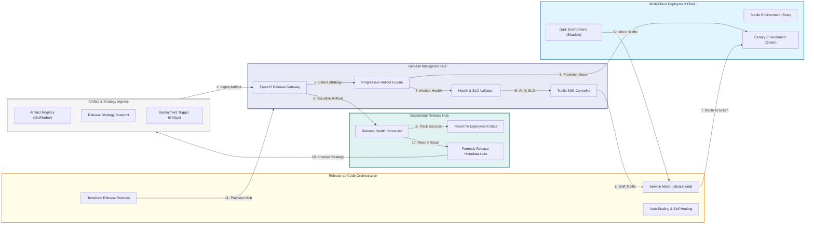
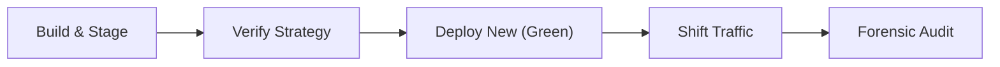
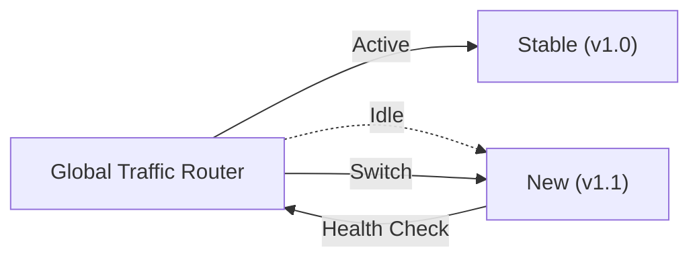
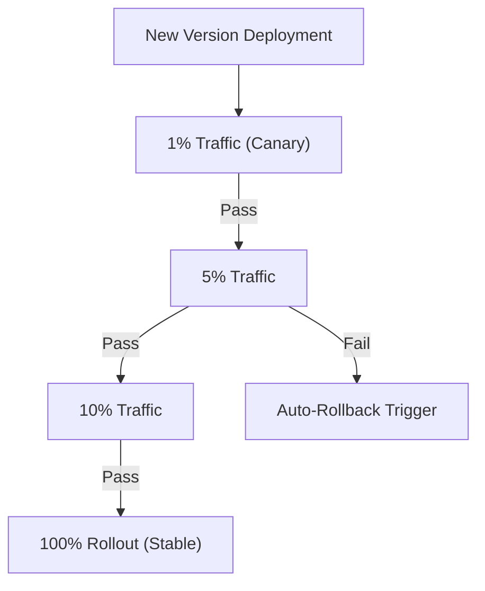
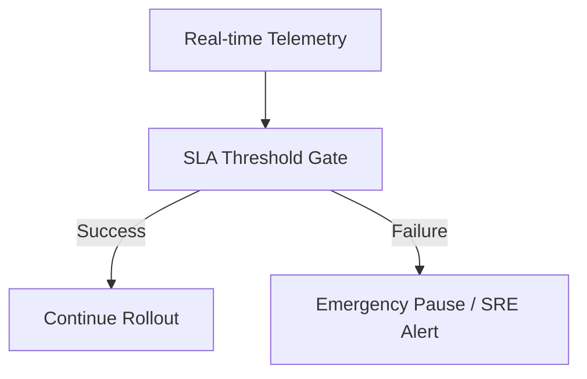
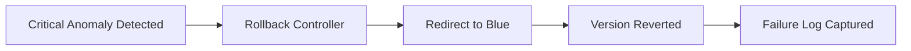
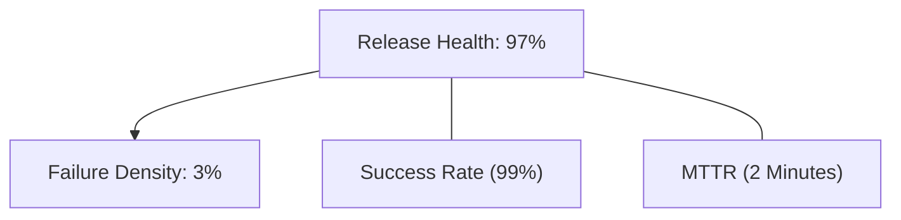
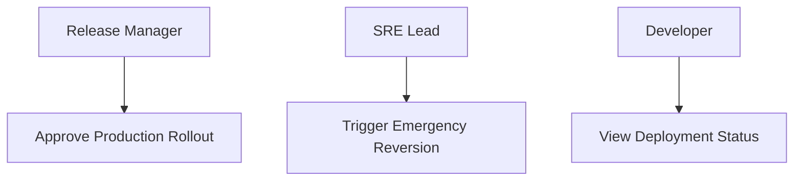
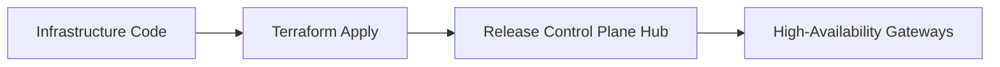
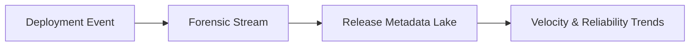

<div align="center">


<h1>Zero Downtime Deployment Strategies</h1>

<p><strong>The Strategic Foundation for Enterprise Release Engineering, Progressive Rollout Orchestration, and Automated Reliability Governance.</strong></p>

[]()
[]()
[]()

<br/>

> **"Speed is essential, but reliability is non-negotiable."** 
> **Zero Downtime Deployment Strategies** is an enterprise-grade platform designed to provide a secure, measurable, and highly automated foundation for global software delivery. It orchestrates the complex lifecycle of application releases—from Blue/Green and Canary deployments to real-time traffic shifting and automated rollback pipelines.

</div>

---

## 🏛️ Executive Summary

Service interruptions during deployments are strategic operational liabilities; lack of structured release strategies is a primary barrier to continuous innovation. Organizations fail to achieve zero-downtime not because of a lack of code, but because of fragmented deployment standards, lack of automated health validation, and an inability to orchestrate traffic shifting with operational precision.

This platform provides the **Release Intelligence Plane**. It implements a complete **Enterprise Release-as-Code Framework**, enabling SRE and DevOps teams to manage the software rollout as a first-class citizen. By automating progressive deployment patterns and orchestrating real-time reliability guardrails, we ensure that every application update—from backend services to frontend assets—is delivered with zero impact to end users, audited for history, and strictly aligned with institutional availability SLAs.

---

## 📐 Architecture Storytelling: Principal Reference Models

### 1. Principal Architecture: Global Zero-Downtime Deployment & Release Control Plane
This diagram illustrates the end-to-end flow from CI/CD artifact ingestion and strategy selection to progressive traffic shifting, health validation, and institutional release auditing.



### 2. The Release Lifecycle Flow
The continuous path of a software release from initial build and staging to active verification, deployment, traffic shifting, and forensic auditing.



### 3. Blue/Green Deployment Orchestration Flow
Orchestrating identical "Stable" and "New" environments to enable instantaneous, zero-downtime switching between versions via a global load balancer or service mesh.



### 4. Canary Deployment (Progressive Rollout) Flow
Strategically shifting traffic to a new version in incremental stages (1%, 5%, 10%, 100%) while continuously monitoring for performance degradation or errors.



### 5. Shadow (Dark) Deployment Flow
Mirroring live production traffic to a new version to validate performance and correctness in the background without affecting the end-user experience.

```mermaid
graph LR
    User["End User Traffic"] --> Mesh["Service Mesh Mirror"]
    Mesh -->|Real Response| Blue["Stable (Production)"]
    Mesh -->|Mirror (No Return)| Green["Shadow (Validation)"]
    Green --- Analytics["Side-by-Side Analysis"]
```

### 6. Automated Health Validation & Gating
Using real-time SLIs and SLOs—such as Error Rate (5xx) and P99 Latency—to automatically gate or pause deployments that do not meet institutional standards.



### 7. Emergency Rollback & Reversion Flow
Automating the path back to a known-good state by instantaneously redirecting traffic to the previous stable version upon detection of a critical failure.



### 8. Institutional Release Health Scorecard
Grading organizational performance based on key indicators: Deployment Velocity, Change Failure Rate, and Average Time to Rollback.



### 9. Identity & RBAC for Release Governance
Managing fine-grained access to deployment strategies, traffic shifting controls, and emergency rollback triggers between Release Managers and SREs.



### 10. IaC Deployment: Release-as-Code Framework
Using Terraform to deploy and manage the versioned distribution of the release control plane, traffic shifters, and automated health validators.



### 11. Metadata Lake for Forensic Release Audit
Storing long-term records of every deployment version, traffic shift event, and health validation result for institutional investigation and compliance.



---

## 🏛️ Core Release Pillars

1.  **Progressive Rollout Strategy**: Managing complex Blue/Green and Canary patterns with maximum automated safety.
2.  **Intelligent Traffic Steering**: Orchestrating granular traffic shifts using modern service mesh and ingress fabric.
3.  **SLA-Driven Gating**: Automatically pausing or reverting deployments based on real-time reliability signals.
4.  **Shadow Validation Architecture**: Testing new versions against live traffic without impacting production users.
5.  **Automated Rollback Assurance**: Providing an instantaneous, failure-proof path back to the last known-good state.
6.  **Full Release Auditability**: Immutable recording of every deployment decision and traffic change for institutional forensics.

---

## 🛠️ Technical Stack & Implementation

### Release Engine & APIs
*   **Framework**: Python 3.11+ / FastAPI.
*   **Deployment Core**: Custom logic for orchestrating Blue/Green, Canary, and Shadow strategy resolution.
*   **Traffic Orchestrator**: Integration with Istio and Ingress controllers for weighted traffic distribution.
*   **Health Validator**: Intelligent engine for monitoring Prometheus SLIs and gating rollouts.
*   **State Management**: PostgreSQL (Metadata Lake) and Redis (Live Deployment Cache).

### Release Dashboard (UI)
*   **Framework**: React 18 / Vite.
*   **Theme**: Indigo, Violet, Slate (Modern SRE & operational aesthetic).
*   **Visualization**: Recharts for traffic shift matrices, rollout velocity, and strategy usage analytics.

### Infrastructure & DevOps
*   **Runtime**: AWS EKS or Azure Kubernetes Service (AKS).
*   **Mesh Fabric**: Istio or Linkerd for transparent, high-performance service-to-service routing.
*   **IaC**: Modular Terraform for deploying the release hub and traffic gateway distributions.

---

## 🏗️ IaC Mapping (Module Structure)

| Module | Purpose | Real Services |
| :--- | :--- | :--- |
| **`infrastructure/rel_hub`** | Central management plane | EKS, PostgreSQL, Redis |
| **`infrastructure/mesh`** | Traffic shifting backbone | Istio, Envoy, Ingress |
| **`infrastructure/health`** | SLO validation & Gating | Prometheus, Grafana, Alerts |
| **`infrastructure/auditing`** | Forensic release sinks | S3, Athena, Quicksight |

---

## 🚀 Deployment Guide

### Local Principal Environment
```bash
# Clone the release platform
git clone https://github.com/devopstrio/zero-downtime-deployment-strategies.git
cd zero-downtime-deployment-strategies

# Configure environment
cp .env.example .env

# Launch the Release stack
make up

# Trigger a mock Blue/Green deployment and traffic shift simulation
make simulate-deploy
```

Access the Release Dashboard at `http://localhost:3000`.

---

## 📜 License
Distributed under the MIT License. See `LICENSE` for more information.

---
<div align="center">
  <p>© 2026 Devopstrio. All rights reserved.</p>
</div>
