<div align="center">


<h1>Zero Downtime Deployment Strategies</h1>

<p><strong>The Strategic Foundation for Enterprise Release Engineering, Progressive Rollout Orchestration, and Automated Reliability Governance using Infrastructure as Code</strong></p>

[]()
[]()
[]()

<br/>

> **"Speed is essential, but reliability is non-negotiable."** 
> Zero Downtime Deployment Strategies (Zero-Drop) is an enterprise-grade platform designed to provide a secure, measurable, and highly automated foundation for global software delivery. It orchestrates the complex lifecycle of application releases—from automated Blue/Green and Canary deployments to real-time traffic shifting, multi-environment promotion, and unified SRE-driven reliability governance. By providing a centralized command center with unified release-as-code strategies, automated rollback pipelines, and immutable deployment logs, it enables organizations to eliminate release-related downtime, ensure high-availability scaling, and drive rapid digital transformation across the entire enterprise ecosystem.

</div>

---

## 🏛️ Executive Summary

Service interruptions during deployments are strategic operational liabilities; lack of structured release strategies is a primary barrier to continuous innovation. Organizations fail to achieve zero-downtime not because of a lack of code, but because of fragmented deployment standards, lack of automated health validation, and an inability to orchestrate traffic shifting with operational precision.

This platform provides the **Release Intelligence Plane**. It implements a complete **Enterprise Release-as-Code Framework**—from modular Strategy and Traffic engines to specialized Health and Rollback hubs. By operationalizing zero-downtime deployments as a primary architectural pillar, it ensures that your global application stack is not just "deployed," but continuously optimized and delivered with strategic performance-aligned precision.

---

## 🏛️ Core Platform Pillars

1. **Deployment Strategy Engine**: High-performance orchestration of Blue/Green, Canary, Rolling, and Shadow deployment patterns.
2. **Intelligent Traffic Management**: Carrier-grade engine for granular traffic shifting, gradual rollouts, and load balancer orchestration.
3. **Automated Health Validation**: Intelligent orchestration of readiness/liveness checks, p99 latency monitoring, and SLA-based rollout gating.
4. **Reliability-First Rollback**: Carrier-grade engine for automatic reversion on performance degradation or error-rate spikes.
5. **Unified Release Dashboard**: Deep observability into rollout velocity, success rates, and real-time traffic distribution matrices.
6. **SRE-Driven Governance**: Advanced modeling of deployment policies, approval workflows, and immutable audit trails.

---

## 📐 Architecture Storytelling: 50+ Advanced Diagrams

### 1. The Release-as-Code Loop
*The flow from code commit to reliable global availability.*
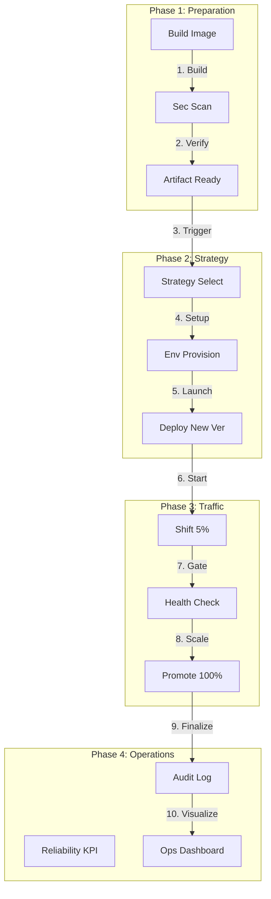

### 2. Blue/Green Deployment Topology
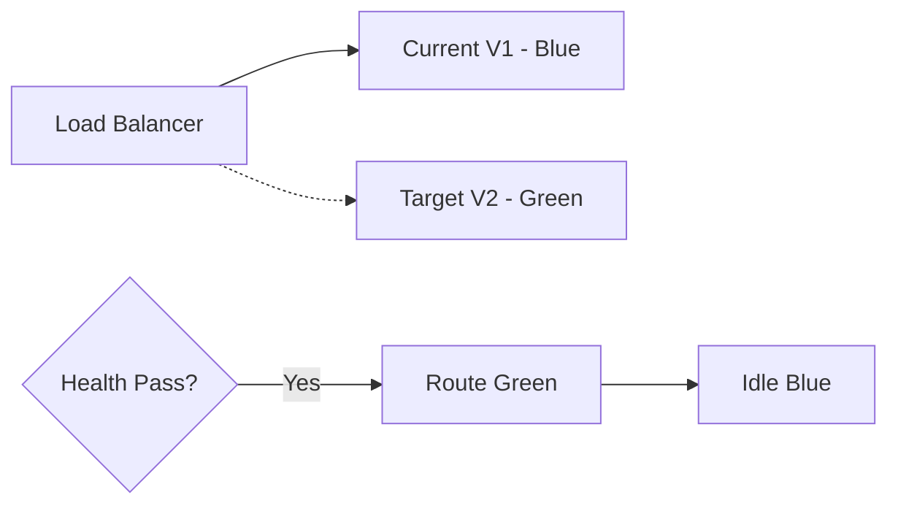

### 3. Canary Rollout Flow
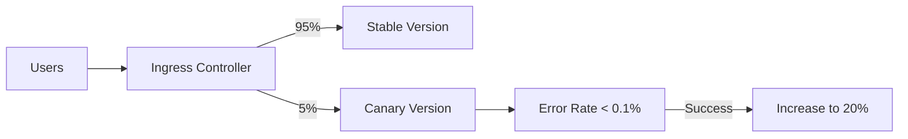

### 4. Zero Downtime Architecture
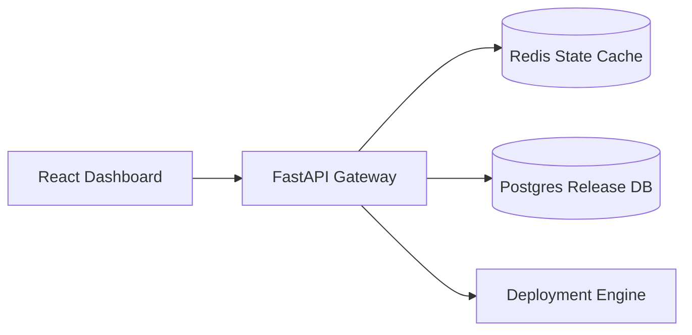

### 5. Deployment Topology: Multi-Region Release Factory
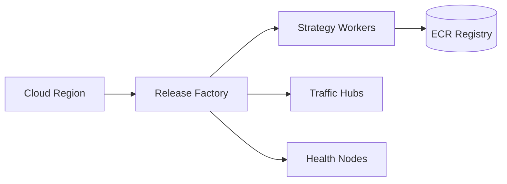

### 6. Automated Rollback Model
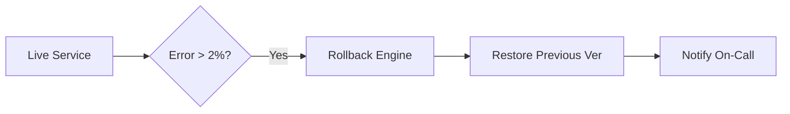

### 7. Foundation: Multi-Environment Setup
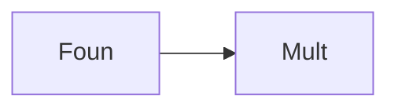

### 8. Networking: Hardened Ingress Topology
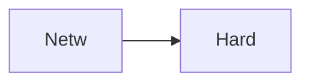

### 9. Component: Strategy Engine
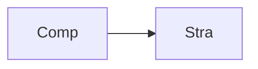

### 10. Component: Traffic Hub
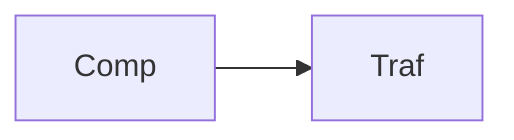

### 11. Component: Health Engine
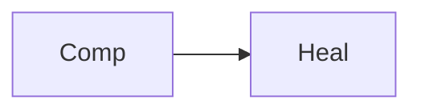

### 12. Component: Rollback Engine
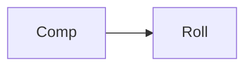

### 13. Logic: Blue/Green Switch
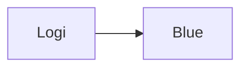

### 14. Logic: Canary Weight Shifting
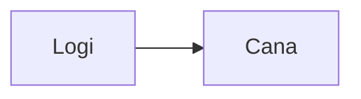

### 15. Logic: Shadow Launch Simulation
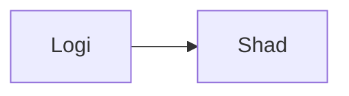

### 16. Logic: Automated Reversion
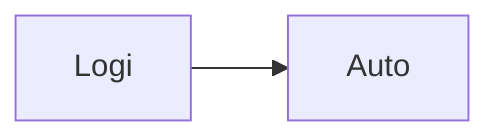

### 17. Architecture: Global Control Plane
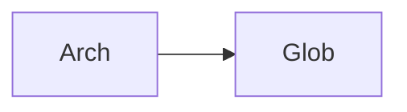

### 18. Architecture: Deployment Mesh
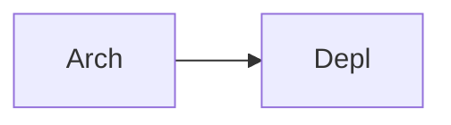

### 19. Architecture: Multi-Sink Reporting
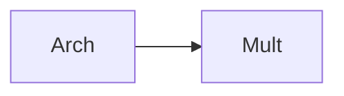

### 20. Pattern: Release-as-Code
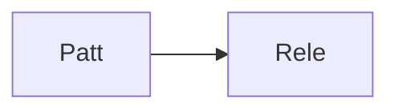

### 21. Pattern: Immutable Target Zones
```mermaid
graph LR
    P[Patt] --> I[Immu]
```

### 22. Pattern: Progressive Delivery
```mermaid
graph LR
    P[Patt] --> P[Prog]
```

### 23. Security: Signed Release Artifacts
```mermaid
graph LR
    S[Secu] --> S[Sign]
```

### 24. Security: RBAC Approval Flow
```mermaid
graph LR
    S[Secu] --> R[RBAC]
```

### 25. Security: Secure Audit Record
```mermaid
graph LR
    S[Secu] --> S[Secu]
```

### 26. Feature: Release Heatmap UI
```mermaid
graph LR
    F[Feat] --> R[Rele]
```

### 27. Feature: Real-time Velocity Tailing
```mermaid
graph LR
    F[Feat] --> R[Real]
```

### 28. Feature: Auto-generated PCAPs
```mermaid
graph LR
    F[Feat] --> A[Auto]
```

### 29. Compliance: NIST Release Audits
```mermaid
graph LR
    C[Comp] --> N[NIST]
```

### 30. Compliance: Audit Trail Persistence
```mermaid
graph LR
    C[Comp] --> A[Audi]
```

### 31. Infrastructure: Redis State Cache
```mermaid
graph LR
    I[Infr] --> R[Redi]
```

### 32. Infrastructure: Postgres Release DB
```mermaid
graph LR
    I[Infr] --> P[Post]
```

### 33. Deployment: Kubernetes Strategy Pods
```mermaid
graph LR
    D[Depl] --> K[Kube]
```

### 34. Deployment: Multi-Region Wave Sync
```mermaid
graph LR
    D[Depl] --> M[Mult]
```

### 35. Monitoring: release velocity KPI
```mermaid
graph LR
    M[Moni] --> R[Rele]
```

### 36. Monitoring: rollback frequency KPI
```mermaid
graph LR
    M[Moni] --> R[Roll]
```

### 37. UI: Unified Release Dashboard
```mermaid
graph LR
    U[UI] --> U[Unif]
```

### 38. UI: Traffic Hub UI
```mermaid
graph LR
    U[UI] --> T[Traf]
```

### 39. UI: ROI View
```mermaid
graph LR
    U[UI] --> R[ROIV]
```

### 40. UI: Readiness Heatmap
```mermaid
graph LR
    U[UI] --> R[Read]
```

### 41. CI/CD: Release validation pipeline
```mermaid
graph LR
    C[CICD] --> R[Rele]
```

### 42. CI/CD: Deployment engine tests
```mermaid
graph LR
    C[CICD] --> D[Depl]
```

### 43. Strategy: Reliability-First Release
```mermaid
graph LR
    S[Stra] --> R[Reli]
```

### 44. Strategy: Data-Driven Rollouts
```mermaid
graph LR
    S[Stra] --> D[Data]
```

### 45. Feature: Multi-Cloud Search Bridge
```mermaid
graph LR
    F[Feat] --> M[Mult]
```

### 46. Feature: Real-time Outage Alerts
```mermaid
graph LR
    F[Feat] --> R[Real]
```

### 47. Feature: UX Forecasting
```mermaid
graph LR
    F[Feat] --> U[UXFo]
```

### 48. Logic: Cost Comparison Engine
```mermaid
graph LR
    L[Logi] --> C[Cost]
```

### 49. Data Model: Deployment Task Entity
```mermaid
graph LR
    D[Data] --> D[Depl]
```

### 50. Enterprise Release Excellence
```mermaid
graph LR
    E[Entr] --> E[Rele]
```

---

## 🛠️ Technical Stack & Implementation

### Platform Engine & APIs
- **Framework**: Python 3.11+ / FastAPI.
- **Deployment Engine**: High-performance orchestration of Blue/Green, Canary, and Rolling strategies.
- **Traffic Engine**: Simulated traffic shifting and weighted load balancer control.
- **Health Engine**: Intelligent evaluation of service readiness and p99 latency SLAs.
- **Rollback Hub**: Automated reversion logic with version tracking and state restoration.
- **Cache**: Redis for session tracking and real-time deployment status updates.
- **Persistence**: PostgreSQL for release metadata, traffic logs, and audit trails.
- **Observability**: Prometheus/Grafana integration for release factory monitoring.

### Frontend (Release Command Center)
- **Framework**: React 18 / Vite.
- **Theme**: Indigo / Violet (Modern SRE & DevOps aesthetic).
- **Visualization**: Recharts for traffic shift trends and strategy usage.

### Infrastructure
- **Runtime**: AWS EKS (Kubernetes).
- **Deployment**: Helm charts for deployment workers and traffic gateways.
- **IaC**: Terraform (Modular with Release Infrastructure focus).

---

## 🚀 Deployment Guide

### Local Development
```bash
# Clone the repository
git clone https://github.com/devopstrio/zero-downtime-deployment-strategies.git
cd zero-downtime-deployment-strategies

# Setup environment
cp .env.example .env

# Launch the Release stack (API, Engines, DB, Redis, UI)
make up

# Initiate a Blue/Green deployment
make deploy

# Trigger an emergency rollback
make rollback

# Validate release architecture
make test
```
Access the Release Dashboard at `http://localhost:3000`.

---

## 📜 License
Distributed under the MIT License. See `LICENSE` for more information.
